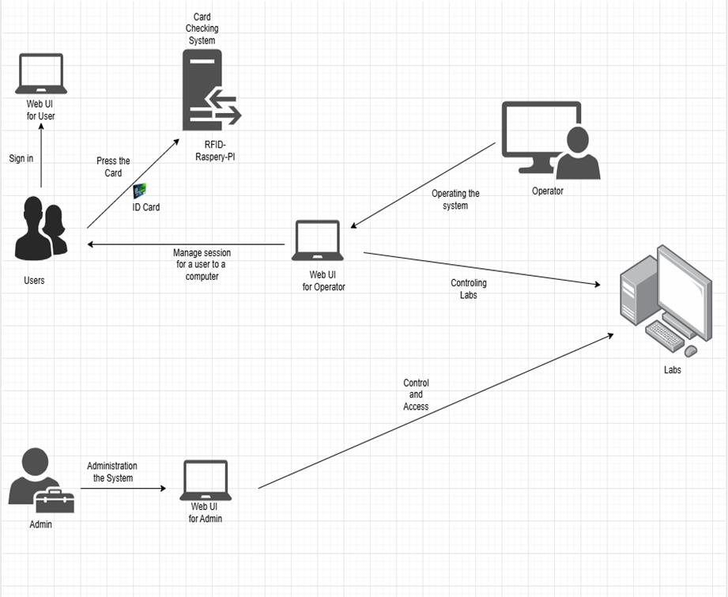
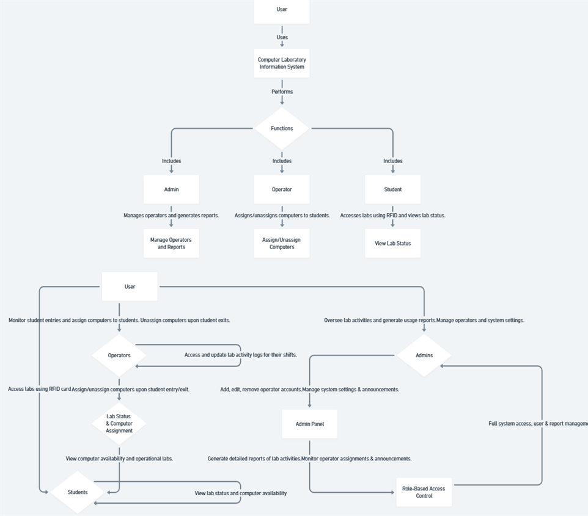
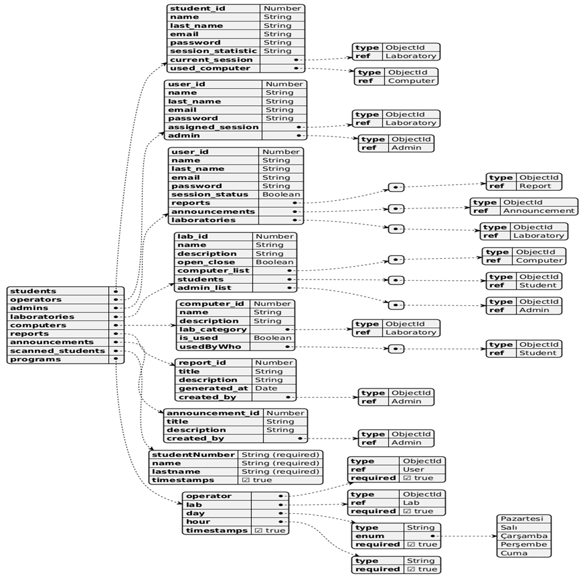
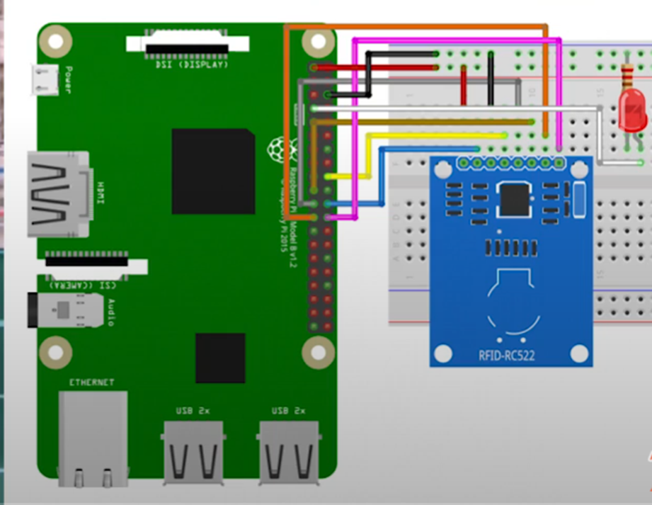
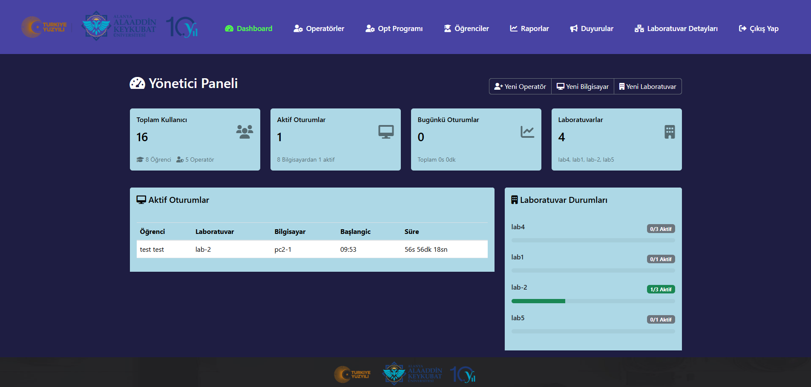
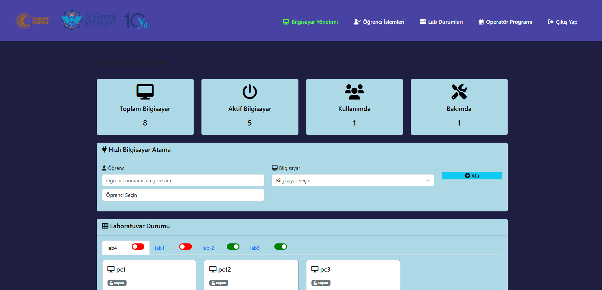
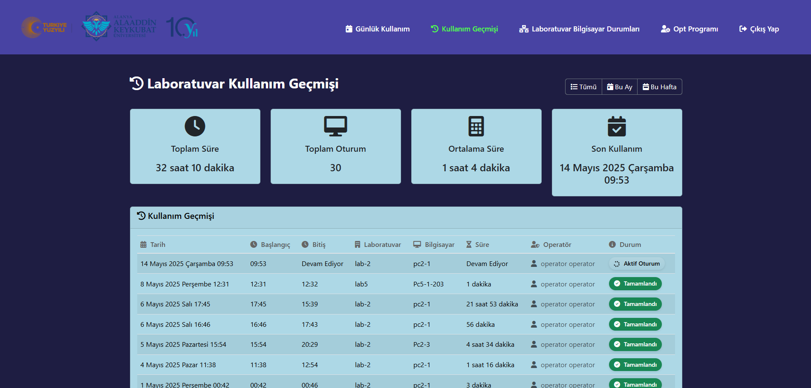

# CLIS – Computer Laboratory Information System

CLIS (Computer Laboratory Information System) is a comprehensive, IoT-powered platform engineered to digitize and streamline the access control and operational management of computer laboratories in educational institutions. Leveraging a robust combination of web technologies and embedded systems specifically RFID authentication integrated with Raspberry Pi hardware CLIS enables seamless, automated check-in/check-out processes, real-time monitoring of lab activity, dynamic computer assignments, and centralized administrative control. It is designed to enhance efficiency, accountability, and security while reducing manual workload and eliminating paper-based tracking systems.

---

## 🎯 Purpose

The primary goal of CLIS (Computer Laboratory Information System) is to modernize and optimize the management of university computer laboratories through automation, real-time monitoring, and secure user access. By leveraging RFID and IoT technologies, CLIS transforms traditional manual processes into a streamlined digital workflow.

Specifically, CLIS aims to:

- ✅ Eliminate paper-based entry systems by automating student authentication via RFID card scans.
- 📊 Enable real-time logging and tracking of student attendance and session activity.
- 💻 Facilitate efficient computer assignment and resource allocation through an operator-managed dashboard.
- 🧠 Provide administrators with centralized tools for user management, analytics, system configuration, and historical reporting.
- 🔐 Enhance access control and security by enforcing role-based authorization.
- ⚙️ Improve operational efficiency and transparency across lab environments.
- 🌐 Lay the foundation for scalable, smart-campus infrastructure in educational institutions.

---

## 👥 User Roles and Responsibilities

CLIS uses **Role-Based Access Control**. Each role has specific responsibilities and dashboard access:

### 🎓 Students
- Authenticate access to computer labs via RFID smart cards.
- Track their personal lab attendance logs and session history.
- Query real-time availability of lab resources through the web interface.
- View operator schedules in advance and plan their lab visits accordingly.

### 🧑‍💻 Operators
- Oversee active lab environments with real-time occupancy dashboards.
- Dynamically allocate or release computing resources to authorized users.
- Manage workstation statuses by toggling between operational, maintenance, or fault states.
- Validate and rectify anomalies in attendance or session logs.
- Collaboratively create and manage their own lab duty schedules, ensuring proper staff availability and shift coverage.

### 🛡️ Administrators
- Centrally manage system users, including role-based account provisioning for students and operators.
- Configure and maintain lab inventories, including adding, updating, or deprecating lab resources and machines.
- Generate and export advanced analytical reports on attendance metrics, lab utilization, and system health.
- Broadcast institutional or system-wide announcements to targeted user roles.
- Monitor and audit all lab operations in real time with elevated access controls and administrative insights.

---

## 🧩 Features

- 🔐 **RFID-based Authentication**
- 📡 **Raspberry Pi Integration**
- 🖥️ **Real-time Lab Monitoring**
- 👥 **Multi-role Web Dashboard (Student, Operator, Admin)**
- 💾 **MongoDB Cloud Database**
- 📊 **Detailed Usage Reports**
- 🧠 **Operator Scheduling**
- 🚦 **Computer Status Management**
- 🔒 **Data Encryption and Role Authorization**
- 🌍 **Scalable and User-Friendly Design**
- 🎇 **Others...**

---

## 🧠 System Design & Architecture

This section outlines the core design components of the CLIS system, including user interaction, system structure, data modeling, and hardware communication.

### 🧱 System Architecture
Provides an overview of software, hardware, and communication layers.

---

### 📌 Use Case Diagram
Illustrates the interaction between system users and functionalities.

---

### 🧩 Data Model(Class Diagram)
Describes the relationship between entities in the database.

---

### 📡 Raspberry Pi – RFID
Demonstrates the real-time interaction between RFID reader, Raspberry Pi, and backend API.

---

## 🧰 Technology Stack

### 🔙 Backend & API
- **Node.js** – Event-driven JavaScript runtime environment powering the backend.
- **Express.js** – Minimalist web framework for building fast and scalable RESTful APIs.
- **Mongoose** – Elegant MongoDB object modeling for Node.js.

### 🗄️ Database
- **MongoDB (Cloud / Local)** – NoSQL document database designed for high availability and scalability.
- **MongoDB Atlas** – Fully managed cloud database service used for production deployment.
- **dotenv** – Manages environment variables securely for configuration management.

### 🖥️ Frontend
- **EJS (Embedded JavaScript Templates)** – Templating engine for generating HTML markup with plain JavaScript.
- **HTML5 & CSS3** – For structuring and styling responsive user interfaces.
- **JavaScript (ES6+)** – Client-side scripting for dynamic content updates.
- **Bootstrap 5** – Responsive CSS framework used to create clean, mobile-first UI components and layouts.

### 💡 IoT & Hardware Integration
- **Raspberry Pi** – Acts as the hardware bridge for RFID scanning and server communication.
- **RC522 RFID Reader** – Reads RFID card UIDs via SPI interface.
- **Python 3** – Scripting language used for handling RFID scans and sending HTTP requests to the backend.
- **GPIO & SPI** – Communication protocols on Raspberry Pi for hardware interfacing.

### 🔐 Security & Authorization
- **Role-Based Access Control (RBAC)** – Differentiated access levels for Students, Operators, and Admins.
- **JWT / Session Authentication** – (Optional extension) Secure authentication token handling.
- **Data Encryption (at rest & in transit)** – Ensuring privacy and compliance with data protection standards (KVKK/GDPR).

### 🔧 Tools & Utilities
- **nodemon** – Automatically restarts the Node.js server during development.
- **Postman** – API testing and debugging during backend development.
- **VS Code** – Primary code editor used in the development process.
- **Git + GitHub** – Version control and collaboration.

### 📊 Reporting & Monitoring *(Planned/Optional)*
- **Chart.js / D3.js** – Data visualization for admin reporting panels.
- **Socket.io** – Real-time bi-directional communication for live dashboard updates.
- **Cron Jobs / Node Schedule** – Task automation for periodic data cleanup or reminders.

---

## 🖼️ Sample Screenshots

> Add screenshots in the `screenshots/` folder and link them here:
### ADMIN

### OPERATOR

### STUDENT

---

---

## 📚 Project Background

This project was developed as a final year thesis for the Computer Engineering Department at Alanya Alaaddin Keykubat University.

> [View Thesis Document (PDF)](./docs/ALKU_CLIS_Thesis.pdf)

---

## 🔮 Future Enhancements

- **Cross-Platform Mobile Application**  
  Develop a native or hybrid mobile app (using Flutter or React Native) to provide real-time notifications, lab schedules, and self check-in/out capabilities.

- **Advanced UX/UI Revamp**  
  Redesign the user interface with modern design systems (e.g., Bootstrap 5, Material Design) for enhanced accessibility, responsiveness, and user satisfaction.

- **Peripheral System Integration**  
  Extend the system to manage additional lab resources such as smart lockers, 3D printers, and shared peripherals via modular APIs and GPIO extensions.

- **Face Recognition-Based Authentication (Optional Mode)**  
  Integrate a privacy-compliant facial recognition system as an alternative or secondary authentication method using OpenCV or cloud-based vision APIs. Ideal for environments requiring elevated security, this mode would support dual-authentication along with RFID or for entry-only terminals.

---

## 👨‍💻 Authors

- **Bünyamin Yavuz** – Developer – [GitHub](https://github.com/BunyaminYavuz)
- **Ömer Aygün** – Developer - [GitHub](https://github.com/OmerAygunn)

---

## 📄 License

This project is licensed under the MIT License.

---

## 🔖 Tags

`RFID` `Raspberry Pi` `Node.js` `IoT` `MongoDB` `Lab Management` `Access Control` `Fullstack` `Educational Tech`